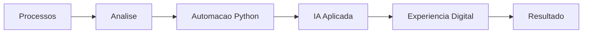

<!--
README de perfil GitHub - Lucas Lima | devlucaslim4
EDITAR: atualize links de email, LinkedIn, portfolio e projetos quando quiser.
-->

 

<h3>Transformando processos e experiencias digitais com IA e automacao.</h3>

 

 

<table>
<tr>
<td width="50%" valign="top">

## Sobre mim

Sou **Lucas Lima | devlucaslim4**, desenvolvedor focado em criar solucoes digitais que unem **desenvolvimento web**, **inteligencia artificial aplicada**, **automacao com Python** e **analise de processos**.

Minha abordagem combina visao tecnica, organizacao de projetos e atencao a experiencia visual para entregar interfaces modernas, fluxos mais eficientes e produtos digitais com proposito.

</td>
<td width="50%" valign="top">

## Identidade tecnica

`AI-driven workflows` `Python automation` `Minimal UI` `Process intelligence` `Digital experience`

Busco construir solucoes onde **IA + automacao + experiencia digital** trabalham juntas para reduzir esforco manual, melhorar decisoes e transformar processos em produtos mais inteligentes.

</td>
</tr>
</table>

 

## Foco Atual

<table>
<tr>
<td align="center" width="25%">

 
<strong>IA Aplicada</strong>
 
Modelos, prompts, agentes e uso pratico em fluxos reais.
</td>
<td align="center" width="25%">

 
<strong>Web Moderna</strong>
 
Interfaces minimalistas, responsivas e orientadas a experiencia.
</td>
<td align="center" width="25%">

 
<strong>Automacao</strong>
 
Scripts, integracoes e rotinas com Python para ganho operacional.
</td>
<td align="center" width="25%">

 
<strong>Processos</strong>
 
Analise, melhoria continua e organizacao de projetos digitais.
</td>
</tr>
</table>

 

## Tech Stack

 

 

## IA e Automacao

<table>
<tr>
<td width="33%" valign="top">

### Inteligencia Artificial

Estudo IA aplicada para transformar necessidades reais em solucoes praticas: analise, geracao de conteudo, apoio a decisao, agentes e integracoes inteligentes.

</td>
<td width="33%" valign="top">

### Automacao com Python

Crio automacoes para reduzir tarefas repetitivas, organizar dados, integrar ferramentas e acelerar rotinas operacionais com scripts claros e escalaveis.

</td>
<td width="33%" valign="top">

### Processos Digitais

Trabalho com analise de processos e projetos para mapear gargalos, melhorar fluxos e conectar tecnologia com resultado mensuravel.

</td>
</tr>
</table>

 

## GitHub Insights

 

 

## Projetos em Destaque

<!-- EDITAR: substitua estes cards por repositorios reais quando tiver os links definitivos. -->

<table>
<tr>
<td width="50%" valign="top">

### AI Process Assistant

Assistente para analise de processos, identificacao de gargalos e sugestao de automacoes usando IA aplicada.

</td>
<td width="50%" valign="top">

### Minimal Web Interface

Interface web responsiva com estetica minimalista, componentes limpos e foco em usabilidade profissional.

</td>
</tr>
<tr>
<td width="50%" valign="top">

### Python Automation Lab

Colecao de scripts para automacao de tarefas, organizacao de dados, relatorios e integracao entre ferramentas.

</td>
<td width="50%" valign="top">

### Project Analysis Toolkit

Estrutura para documentar, comparar e priorizar projetos com visao de processos, impacto e execucao.

</td>
</tr>
</table>

 

## Timeline de Evolucao

<table>
<tr>
<td align="center" width="20%"><strong>01</strong> Fundamentos Web</td>
<td align="center" width="20%"><strong>02</strong> Python e logica</td>
<td align="center" width="20%"><strong>03</strong> Automacao de processos</td>
<td align="center" width="20%"><strong>04</strong> IA aplicada</td>
<td align="center" width="20%"><strong>05</strong> Produtos digitais inteligentes</td>
</tr>
</table>

 

## Objetivos Atuais

<table>
<tr>
<td width="33%" valign="top">

### Construir

Projetos web modernos, responsivos e com visual premium, mantendo clareza, performance e usabilidade.

</td>
<td width="33%" valign="top">

### Automatizar

Transformar tarefas manuais em fluxos automatizados com Python, integracoes e boas praticas de organizacao.

</td>
<td width="33%" valign="top">

### Evoluir

Aprofundar IA aplicada para criar solucoes que conectem dados, processos, automacao e experiencia digital.

</td>
</tr>
</table>

 

## Contato

 

Design minimalista. Codigo limpo. Processos inteligentes.
 
Lucas Lima | devlucaslim4

