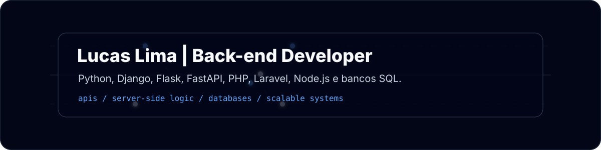

<!--
README de perfil GitHub - Lucas Lima | devlucaslim4
Visual dark minimalista com foco em back-end.
-->

<div align="center">



<br />


### Construindo APIs, sistemas back-end e solucoes orientadas a dados.

<p>
  <a href="mailto:limaadev@outlook.com">
    
  </a>
  <a href="https://www.linkedin.com/in/lucaslimaa15/">
    
  </a>
  <a href="https://github.com/devlucaslim4">
    
  </a>
</p>

</div>

---

## Sobre

Sou **Lucas Lima**, desenvolvedor em formacao com foco em **back-end**, **APIs**, **banco de dados** e construcao de sistemas web.

Atualmente estudo **Python**, **Django**, **Flask**, **FastAPI**, **PHP**, **Laravel**, **JavaScript**, **Node.js**, **React** e bancos de dados relacionais como **Oracle**, **PostgreSQL** e **SQL**.

Meu objetivo e evoluir na criacao de sistemas robustos, organizados e bem estruturados, conectando regra de negocio, persistencia de dados e interfaces web modernas.

---

## Foco tecnico

<table>
  <tr>
    <td width="25%" align="center">
      <h3>Back-end</h3>
      <sub>APIs, regras de negocio, autenticacao e servicos.</sub>
    </td>
    <td width="25%" align="center">
      <h3>Python</h3>
      <sub>Django, Flask, FastAPI e automacoes.</sub>
    </td>
    <td width="25%" align="center">
      <h3>PHP</h3>
      <sub>Laravel, MVC, rotas, controllers e models.</sub>
    </td>
    <td width="25%" align="center">
      <h3>Database</h3>
      <sub>Modelagem, consultas SQL, Oracle e PostgreSQL.</sub>
    </td>
  </tr>
</table>

---

## Stack

<div align="center">


<br /><br />


</div>

---

## Back-end roadmap

```text
HTTP request
  -> routes
  -> controllers / views
  -> services
  -> validation
  -> database
  -> response
```

<table>
  <tr>
    <td width="33%" valign="top">
      <h3>APIs</h3>
      <p>Criação de endpoints, organização de rotas, validações, autenticação e integração entre sistemas.</p>
    </td>
    <td width="33%" valign="top">
      <h3>Banco de dados</h3>
      <p>Estudo de modelagem, relacionamentos, consultas SQL, PostgreSQL, Oracle e boas práticas de persistência.</p>
    </td>
    <td width="33%" valign="top">
      <h3>Arquitetura</h3>
      <p>Separação de responsabilidades, organização de camadas, legibilidade e manutenção de código.</p>
    </td>
  </tr>
</table>

---

## Projetos em evolucao

<!-- Substitua os links abaixo por repositorios reais quando publicar seus projetos. -->

<table>
  <tr>
    <td width="50%" valign="top">
      <h3>API com FastAPI</h3>
      <p>API REST com rotas, validação de dados, documentação automática e persistência em banco relacional.</p>
      <p>
        
        
      </p>
      <a href="https://github.com/devlucaslim4">Ver repositorios</a>
    </td>
    <td width="50%" valign="top">
      <h3>Sistema com Django</h3>
      <p>Aplicação web com autenticação, painel administrativo, models, views e templates organizados.</p>
      <p>
        
        
      </p>
      <a href="https://github.com/devlucaslim4">Ver repositorios</a>
    </td>
  </tr>
  <tr>
    <td width="50%" valign="top">
      <h3>CRUD com Laravel</h3>
      <p>Projeto em PHP/Laravel com rotas, controllers, migrations, models e organização MVC.</p>
      <p>
        
        
      </p>
      <a href="https://github.com/devlucaslim4">Ver repositorios</a>
    </td>
    <td width="50%" valign="top">
      <h3>Node.js API</h3>
      <p>API com JavaScript e Node.js, preparada para integração com front-end React e banco de dados.</p>
      <p>
        
        
      </p>
      <a href="https://github.com/devlucaslim4">Ver repositorios</a>
    </td>
  </tr>
</table>

---

## Estudos atuais

- Python para back-end e automações.
- Django, Flask e FastAPI para criação de sistemas e APIs.
- PHP e Laravel com arquitetura MVC.
- JavaScript, Node.js e React para aplicações web completas.
- Banco de dados relacional com PostgreSQL, Oracle e SQL.
- Boas práticas de organização, versionamento e documentação.

---

## Contato

<div align="center">

<a href="mailto:limaadev@outlook.com">
  
</a>
<a href="https://www.linkedin.com/in/lucaslimaa15/">
  
</a>
<a href="https://github.com/devlucaslim4">
  
</a>

<br /><br />

<sub>Back-end, bancos de dados e sistemas web.</sub>

</div>
