<!--
README de perfil GitHub - Lucas Lima | devlucaslim4
Edite links, projetos e textos conforme evoluir seu portfolio.
-->

<div align="center">



<br />


<h3>Transformando processos e experiencias digitais com IA e automacao.</h3>

<p>
  <a href="mailto:limaadev@outlook.com">
    
  </a>
  <a href="https://www.linkedin.com/in/lucaslimaa15/">
    
  </a>
  <a href="https://github.com/devlucaslim4">
    
  </a>
</p>

</div>

---

## Perfil

Sou **Lucas Lima**, desenvolvedor focado em unir **desenvolvimento web**, **inteligencia artificial aplicada**, **automacao com Python** e **analise de processos**.

Meu foco esta em construir solucoes que diminuem trabalho manual, organizam informacoes, melhoram fluxos e entregam experiencias digitais com visual moderno, minimalista e profissional.

<div align="center">

`IA aplicada` `Automacao Python` `Web moderna` `Analise de processos` `Experiencia digital`

</div>

---

## Sistema de foco

<table>
  <tr>
    <td width="25%" align="center">
      <h3>01</h3>
      <strong>Mapear</strong>
      <br />
      <sub>Processos, dores, gargalos e oportunidades.</sub>
    </td>
    <td width="25%" align="center">
      <h3>02</h3>
      <strong>Automatizar</strong>
      <br />
      <sub>Scripts, rotinas, integracoes e fluxos em Python.</sub>
    </td>
    <td width="25%" align="center">
      <h3>03</h3>
      <strong>Inteligir</strong>
      <br />
      <sub>IA aplicada para apoio, analise e decisao.</sub>
    </td>
    <td width="25%" align="center">
      <h3>04</h3>
      <strong>Entregar</strong>
      <br />
      <sub>Interfaces limpas, responsivas e funcionais.</sub>
    </td>
  </tr>
</table>

---

## Stack principal

<div align="center">


<br /><br />


</div>

---

## IA e automacao

<table>
  <tr>
    <td width="50%" valign="top">
      <h3>Inteligencia Artificial aplicada</h3>
      <p>
        Estudo o uso pratico de IA para analise, estruturacao de informacoes, apoio a decisao,
        geracao de conteudo tecnico e criacao de fluxos mais inteligentes.
      </p>
      <p>
        
        
        
      </p>
    </td>
    <td width="50%" valign="top">
      <h3>Automacao com Python</h3>
      <p>
        Crio scripts e rotinas para reduzir tarefas repetitivas, organizar dados, integrar ferramentas,
        gerar relatórios e tornar processos mais previsiveis.
      </p>
      <p>
        
        
        
      </p>
    </td>
  </tr>
</table>

```text
input: processo manual
  -> analise do fluxo
  -> automacao Python
  -> inteligencia artificial aplicada
  -> interface digital clara
output: menos atrito, mais velocidade e melhor experiencia
```

---

## Projetos em destaque

<!-- Substitua os links por repositorios reais quando quiser destacar seus projetos. -->

<table>
  <tr>
    <td width="50%" valign="top">
      <h3>AI Process Assistant</h3>
      <p>Assistente para analisar processos, identificar gargalos e sugerir automacoes com apoio de IA.</p>
      <p>
        
        
        
      </p>
      <a href="https://github.com/devlucaslim4">Ver projeto</a>
    </td>
    <td width="50%" valign="top">
      <h3>Automation Lab</h3>
      <p>Laboratorio de scripts para automacao de tarefas, organizacao de dados e integracao entre ferramentas.</p>
      <p>
        
        
      </p>
      <a href="https://github.com/devlucaslim4">Ver projeto</a>
    </td>
  </tr>
  <tr>
    <td width="50%" valign="top">
      <h3>Minimal Web Interface</h3>
      <p>Interface moderna, responsiva e minimalista para transformar ideias em experiencias digitais claras.</p>
      <p>
        
        
        
      </p>
      <a href="https://github.com/devlucaslim4">Ver projeto</a>
    </td>
    <td width="50%" valign="top">
      <h3>Project Analysis Toolkit</h3>
      <p>Estrutura para documentar, comparar e priorizar projetos com foco em impacto, clareza e execucao.</p>
      <p>
        
        
      </p>
      <a href="https://github.com/devlucaslim4">Ver projeto</a>
    </td>
  </tr>
</table>

---

## Evolucao profissional

| Fase | Direcao |
|---|---|
| Fundamentos | HTML, CSS, JavaScript, logica e Git |
| Automacao | Python, scripts, rotinas e integracoes |
| Processos | Analise de fluxos, projetos e melhoria operacional |
| IA aplicada | Prompts, agentes, automacao inteligente e apoio a decisao |
| Experiencia digital | Interfaces modernas, minimalistas e orientadas a resultado |

---

## Objetivos atuais

- Aprofundar estudos em **inteligencia artificial aplicada**.
- Criar automacoes com **Python** para resolver problemas reais.
- Desenvolver interfaces modernas, minimalistas e responsivas.
- Unir **IA + automacao + experiencia digital** em projetos praticos.
- Evoluir em analise de processos, documentacao e execucao de projetos.

---

## Contato

<div align="center">

<a href="mailto:limaadev@outlook.com">
  
</a>
<a href="https://www.linkedin.com/in/lucaslimaa15/">
  
</a>
<a href="https://github.com/devlucaslim4">
  
</a>

<br /><br />

<sub>Design minimalista. Codigo limpo. Processos inteligentes.</sub>

</div>
